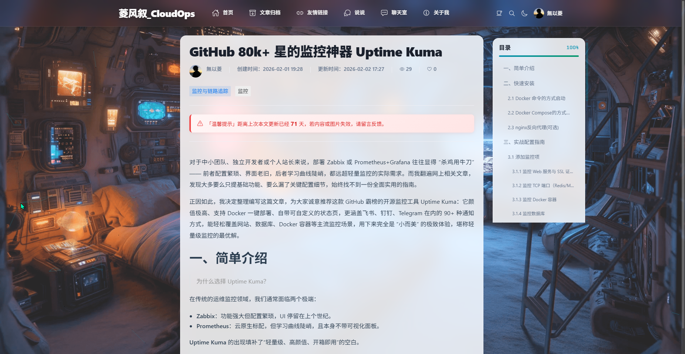
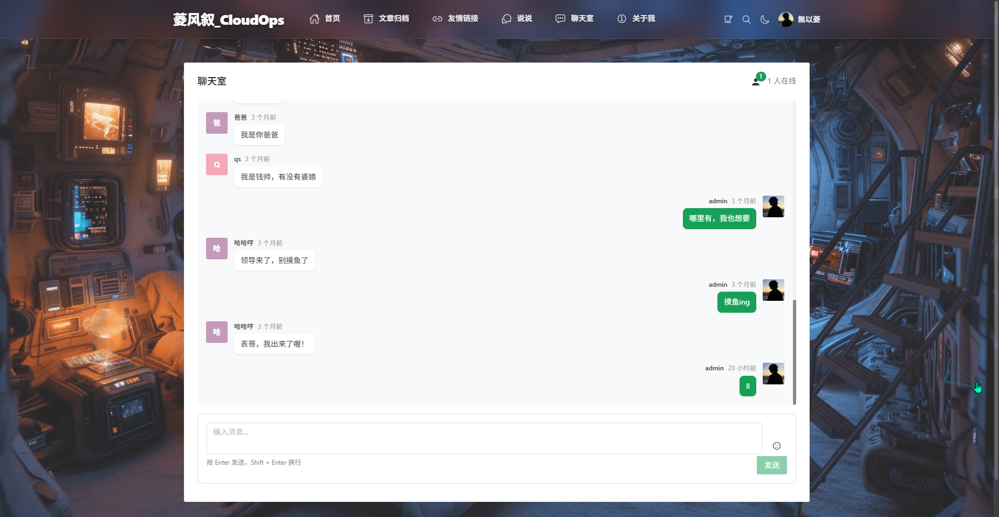
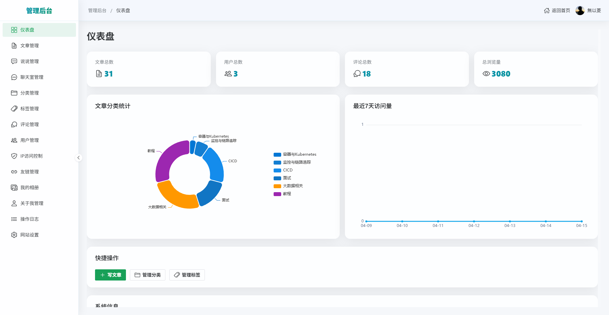
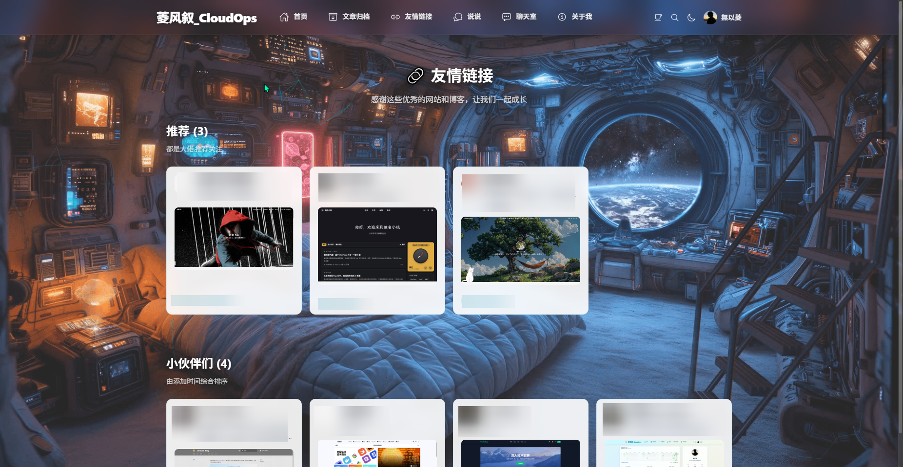
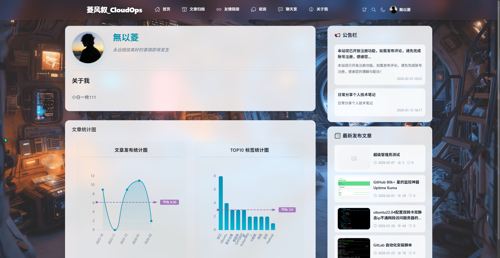
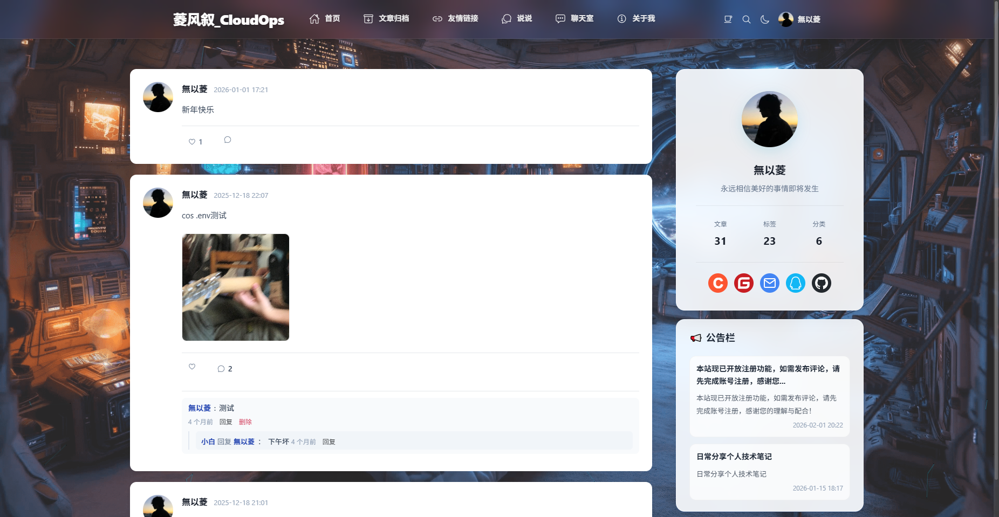

# 个人博客系统

> 基于[情随事迁](https://gitee.com/qssq9398)大佬的开源项目进行的二次开发
>
> 原项目地址：https://gitee.com/qssq9398/go-vue3-blog

一个基于 Vue 3 + Go + Gin 的现代化全栈博客系统，采用前后端分离架构，具有优雅的 UI 设计和完善的功能。


# 一、在线演示

**网站地址**：[https://huangjingblog.cn/](https://huangjingblog.cn/)

- 支持 PC、平板、手机访问
- 可以访问聊天室与其他用户实时交流
- 支持匿名访问或注册登录


# 二、项目截图

## 2.1 首页


## 2.2 文章详情


## 2.3 聊天室


## 2.4 管理后台


## 2.5 友情链接



## 2.6 关于我



## 2.7 说说




# 三、本地开发快速启动

## 3.1 环境要求

- **Node.js** >= 18.0.0
- **Go** >= 1.21
- **PostgreSQL** >= 15
- **Redis** >= 3.0（建议 >= 6.2 以避免客户端警告）
- **pnpm**（推荐）或 npm

> 如果本地没有安装部署 PostgreSQL /Redis，可参考以下docker快速部署相关数据库（可选）。

创建 `pgsql` 指令：

```bash
docker run -d --name pg-prod \
  -p 5432:5432 \
  -v /data/PgSqlData:/var/lib/postgresql/data \
  -e POSTGRES_PASSWORD="123456ok!" \
  -e LANG=C.UTF-8 \
  -e TZ=Asia/Shanghai \
  postgres:17-alpine
```

创建`redis`指令:

```bash
docker run -d --name redis-prod \
  -p 6379:6379 \
  --restart=always \
  -v /data/redisData:/data \
  -e REDIS_PASSWORD=123456 \
  -e TZ=Asia/Shanghai \
  redis:7-alpine \
  redis-server --requirepass 123456 --appendonly yes
```

查看是否创建成功：

```bash
[root@docker-server ~]# docker ps
CONTAINER ID   IMAGE                COMMAND                  CREATED          STATUS          PORTS                                         NAMES
51e019841d66   redis:7-alpine       "docker-entrypoint.s…"   18 minutes ago   Up 18 minutes   0.0.0.0:6379->6379/tcp, [::]:6379->6379/tcp   redis-prod
22205f8e78c6   postgres:17-alpine   "docker-entrypoint.s…"   34 minutes ago   Up 34 minutes   0.0.0.0:5432->5432/tcp, [::]:5432->5432/tcp   pg-prod
```

## 3.2 克隆项目

```bash
git clone https://github.com/WuYiLingOps/gin-vue3-blog.git
cd gin-vue3-blog
```

## 3.3 数据库配置

### 3.3.1 本地数据库导入

创建 PostgreSQL 数据库（指定编码/排序，便于跨版本迁移一致）：

```bash
psql -Upostgres -c " \
  CREATE DATABASE blogdb \
  WITH OWNER = postgres \
    ENCODING = 'UTF8' \
    LC_COLLATE = 'en_US.UTF-8' \
    LC_CTYPE = 'en_US.UTF-8' \
    TEMPLATE = template0;“
```

导入初始化数据：

```bash
psql -U postgres -d blogdb -f blog-backend/sql/init.sql
```

### 3.3.2 容器数据库导入

进入容器内的 psql 交互界面：

```bash
docker exec -it pg-prod psql -U postgres
```

在 psql 中创建 blogdb 库（执行后输入 `\q` 退出）：

```bash
CREATE DATABASE blogdb
WITH OWNER = postgres
  ENCODING = 'UTF8'
  LC_COLLATE = 'en_US.UTF-8'
  LC_CTYPE   = 'en_US.UTF-8'
  TEMPLATE   = template0;
```

开始导入数据：

```bash
# 将 init.sql 传入容器
docker cp blog-backend/sql/init.sql pg-prod:/tmp/init.sql

# 导入数据
docker exec -it pg-prod psql -U postgres -d blogdb -f /tmp/init.sql
```

导入完成。

___


> **注意**：新安装的数据库已包含 slug 字段，无需运行此脚本。只有从旧版本升级时才需要运行（可选）。

为现有文章生成slug（如果是从旧版本升级）：

```bash
cd blog-backend
go run cmd/migrate-slug/main.gos
```

## 3.4 后端配置与启动

> 如果没有配置go的镜像代理，可以参考 [Go 国内加速：Go 国内加速镜像 | Go 技术论坛](https://learnku.com/go/wikis/38122)。

1. 进入后端目录下载相关依赖：

```bash
cd blog-backend
go mod download
```

2. 配置数据库连接和邮箱服务：

```bash
# 推荐方案：YAML + .env.config.dev 组合

# （1）编辑 config/config-dev.yml，填入非敏感的默认配置（主机、端口等）
#     参考示例：blog-backend/config/env.config.example
vim config/config-dev.yml

# （2）在后端项目根目录（blog-backend）创建并配置敏感信息文件
#     步骤1：复制模板文件
cp config/env.config.example .env.config.dev

#     步骤2：编辑 .env.config.dev，取消注释并填写实际敏感信息
vim .env.config.dev
#     示例配置内容（填写时替换为实际值）：
# DB_HOST=127.0.0.1
# DB_PORT=5432
# DB_USER=postgres
# DB_PASSWORD=安全的数据库密码
# DB_NAME=blogdb
# REDIS_HOST=127.0.0.1
# REDIS_PORT=6379
# REDIS_PASSWORD=安全的redis密码
# JWT_SECRET=更复杂的JWT密钥
# EMAIL_PASSWORD=邮箱授权码

# （3）邮箱服务配置（用于密码重置，填写到对应配置文件）
# email:
#   host: smtp.qq.com
#   port: 587
#   username: your-email@qq.com
#   password: your-auth-code  # QQ邮箱授权码
#   from_name: 菱风叙
```

3. 配置 Gitee 贡献热力图（可选）：

> **注意：**使用贡献热力图前需在管理员后台中，填写 Gitee 链接并保存，否则无法自动获取用户名来请求热力图
>
> 例如：`https://gitee.com/WuYiLingOps`
>
> Gitee 贡献热力图爬取逻辑已内置于后端，无需额外启动独立服务。

4. 运行后端服务：

```bash
go run cmd/server/main.go
```

后端服务默认运行在 `http://localhost:8080` 。

## 3.5 前端配置与启动

进入前端目录下载相关依赖：

```bash
# 进入前端目录
cd blog-frontend

# 1. 安装依赖
# 如果没有安装pnpm，可全局安装：npm install -g pnpm
pnpm install

# 2. 配置 API 地址（可选）
# 配置说明：
# - 后端端口 = 8080：可以不配置 .env.development（使用默认值 http://localhost:8080）
# - 后端端口 ≠ 8080：需要配置 .env.development（指定正确端口，例如后端端口改为 8090）
#   创建 .env.development 文件，例如：
echo "VITE_API_BASE_URL=http://localhost:8090" > .env.development
# 注意：
# - VITE_API_BASE_URL 仅影响前端如何访问「自己的后端」，
#   Gitee 贡献热力图由后端内置爬取并缓存，不受前端 .env.development 影响
# - 修改 .env.development 后需要重新执行 pnpm dev 才能生效

# 3. 启动开发服务器
pnpm dev
```

前端服务默认运行在 `http://localhost:3000` 。

### 3.5.1 网站运行时间起始日期修改（可选）

> 场景：更换服务器或迁移部署路径后，希望重置首页底部「本站已平稳运行 X 天」的统计起始时间。

假设线上部署路径为 `/data/myBlog `，可以在服务器上执行以下命令，一键更新前端布局文件中的 `siteStartDate` 为当前时间：

```bash
sed -i "/^const siteStartDate/c const siteStartDate = new Date('$(date '+%F %T')')" /web/gin-vue3-blog/blog-frontend/src/layouts/DefaultLayout.vue
```

执行完成后，重新构建并部署前端（或重启前端服务），页面底部显示的「网站已运行天数」会从新的起始时间重新计算。

### 3.5.2 更换后端端口（如从 `8080` 改为 `8090`）（可选）

开发环境下，如需修改后端监听端口，只需按以下步骤同步调整配置：

- **后端（Go 服务）：**
  - 编辑 `blog-backend/config/config-dev.yml`：
    - 将 `app.port: 8080` 改为 `app.port: 8090`
  - 重启后端服务：
    - `cd blog-backend && go run cmd/server/main.go`
  - 确认浏览器或 `curl` 能访问新的端口：`http://localhost:8090/api/blog/author`
- **前端开发服务器（Vite 代理）：**
  - 在 `blog-frontend` 目录下创建或修改 `.env.development`：
    - `VITE_API_BASE_URL=http://localhost:8090`
  - `vite.config.ts` 中已通过 `VITE_API_BASE_URL` 自动配置代理目标，因此修改环境变量后**需重新执行**：
    - `cd blog-frontend && pnpm dev`
- **生产环境（可选）：**
  - 后端：在 `config/config-prod.yml` 中同步修改 `app.port`
  - Nginx：将所有 `127.0.0.1:8080` 的 `proxy_pass` 目标修改为新端口（如 `127.0.0.1:8090`）
  - 如前端打包使用 `.env.production` 配置 API 地址，需同步更新其中的 `VITE_API_BASE_URL`

### 3.5.3 访问系统

- **前台首页**：http://localhost:3000
- **管理后台**：http://localhost:3000/admin
- **默认管理员账号**：
  - 用户名：`admin`
  - 密码：`password`

## 3.6 邮箱配置说明

### 3.6.1 QQ邮箱授权码获取

1. 登录QQ邮箱网页版
2. 进入 **设置** → **账号与安全** → **安全设置**
3. 找到 **POP3/IMAP/SMTP/Exchange/CardDAV/CalDAV服务**
4. 开启 **POP3/SMTP服务** 或 **IMAP/SMTP服务**
5. 点击 **生成授权码**，按提示发送短信
6. 获得16位授权码，填入配置文件的 `password` 字段

### 3.6.2 其他邮箱配置

**163邮箱**：

```yaml
email:
  host: smtp.163.com
  port: 465
  username: your-email@163.com
  password: your-auth-code
  from_name: 菱风叙
```

**Gmail**：

```yaml
email:
  host: smtp.gmail.com
  port: 587
  username: your-email@gmail.com
  password: your-app-password
  from_name: 菱风叙
```


# 四、Docker Compose 快速部署（推荐）

所有相关文件统一放在 `deploy/` 目录下，单镜像包含前端（Nginx）和后端（blog-backend），通过 supervisord 管理多进程。

```bash
deploy/
├── Dockerfile                     # 多阶段构建镜像
├── docker-compose.yml             # 容器编排
├── backend-config/                # 后端配置目录（挂载到容器）
├── backend-env/
│   └── .env.config.prod           # 敏感环境变量（不提交 Git）
├── uploads/                       # 上传文件持久化
├── logs/                          # 日志持久化
├── PgSqlData/                     # PostgreSQL 数据持久化
├── redisData/                     # Redis 数据持久化
└── docker/
    ├── nginx/default.conf         # 容器内 Nginx 配置
    └── supervisord.conf           # 进程管理配置
```

## 4.1 准备配置文件

```bash
# 创建敏感环境变量文件
mkdir deploy/backend-env
cp blog-backend/config/env.config.example deploy/backend-env/.env.config.prod # 必选

# 添加配置
vim deploy/backend-env/.env.config.prod
```

`.env.config.prod` 关键配置项：

```bash
# 数据库（使用新建容器时填 172.17.0.1，使用已有容器时填对应 IP）
DB_HOST=172.17.0.1
DB_PORT=5432
DB_USER=postgres
DB_PASSWORD=your_postgres_password
DB_NAME=blogdb

# Redis
REDIS_HOST=172.17.0.1
REDIS_PORT=6379
REDIS_PASSWORD=your_redis_password

# JWT
JWT_SECRET=your_jwt_secret

# 邮箱 （可选）
......

# 对象存储(腾讯、阿里)(可选)
.....
```

```

## 4.2 构建镜像（可选）

如果不想使用阿里云镜像仓库的镜像，可直接在本地手动构建（默认使用阿里云镜像仓库地址）：

```bash
# 在 deploy/ 目录下构建（构建上下文为项目根目录）
cd deploy
docker build -t gin-vue3-blog:prod -f Dockerfile ..
```

## 4.3 启动服务

`docker-compose.yml` 支持两种模式，按需选择：

**模式一：新建 PostgreSQL + Redis 容器（默认）**

首次启动会自动创建 `blogdb` 数据库并导入 `blog-backend/sql/init.sql` 初始数据：

```bash
cd deploy
docker compose up -d
```

**模式二：使用已有容器**

编辑 `deploy/docker-compose.yml`：

1. 注释掉 `postgres` 和 `redis` 服务块
2. 注释掉 `blog.depends_on` 块
3. 取消注释 `blog.environment` 中的 `DB_HOST` / `REDIS_HOST` 并填入已有容器地址

```bash
cd deploy
docker compose up -d
```

## 4.4 服务管理

```bash
# 查看服务状态
docker compose ps

# 查看日志
docker compose logs -f blog

# 重启 blog 服务
docker compose restart blog

# 停止所有服务
docker compose down

# 停止并删除数据卷（谨慎！数据会丢失）
docker compose down -v
```

## 4.5 宿主机 Nginx 反代（可选）

如需通过宿主机 Nginx 配置 HTTPS，将 `docker-compose.yml` 中端口改为 `8080:80`，然后参考 `nginx-config/go-blog-prod-docker.conf` 配置宿主机 Nginx。

**服务访问地址：**

- **博客前台**：`http://localhost:80`（或宿主机 Nginx 反代后的域名）
- **PostgreSQL**：`localhost:5432`
- **Redis**：`localhost:6379`


# 五、生产环境部署

## 5.1 快速部署脚本

项目提供了自动化部署管理脚本 `management.sh` ，支持以下操作：

| 命令 | 功能说明 |
|------|----------|
| `build` | 重新构建并部署项目（编译后端 + 构建前端 + 启动服务） |
| `start` | 启动服务（仅启动后端服务，不构建前端） |
| `stop` | 停止所有服务（Go 后端） |
| `status` | 查看服务运行状态（显示端口和 PID） |

**使用方法：**

```bash
# 1. 进入项目根目录
cd /web/gin-vue3-blog

# 2. 添加执行权限（首次使用）
chmod +x management.sh

# 3. 查看帮助
./management.sh

# 4. 执行相应命令
./management.sh build    # 完整构建并部署
./management.sh start    # 启动服务
./management.sh stop     # 停止服务
./management.sh status   # 查看状态
```

> **注意**：使用脚本前请确保：
>
> - 修改脚本中的 `PROJECT_ROOT` 变量为实际的项目路径（默认为 `/web/gin-vue3-blog`）
> - Go 环境已配置
> - pnpm 已安装
> - 项目配置文件已正确设置（`.env.config.prod` 等）
> - Nginx 反向代理已配置完成（参考 [5.4 Nginx反向代理](#5.4-nginx反向代理)）

## 5.2 后端配置及部署

> 和`本地开发快速启动`流程基本一致，这里将详细补充说明。

### 5.2.1 配置与启动后端

> Gitee 贡献热力图爬取逻辑已内置于后端，无需额外部署独立服务。

1. **修改环境配置**：

修改 `config/config.yml` 中的 `env: dev` 为 `env: prod`，系统会自动加载 `config-prod.yml`：

```yaml
# config/config.yml
env: prod
```

2. **创建环境变量文件**：

在后端根目录创建（或编辑）`.env.config.prod` ，通过环境变量配置敏感信息（不再修改 `config/config-prod.yml`）。**模板已提供：`blog-backend/config/env.config.example`** ，可直接复制为 `.env.config.prod` 后按需修改。

> **缓存说明：**
>
> - 前端页面通过后端 API `/api/calendar/gitee?user=<Gitee用户名>` 获取 Gitee 贡献热力图数据
> - 后端内置爬取 Gitee 主页获取贡献数据，并将结果缓存在 Redis 中，键名为 `gitee_calendar:<Gitee用户名>`（20 分钟过期）

构建并启动后端服务：

```bash
cd blog-backend

# 构建后端可执行文件
go build -o blog-backend cmd/server/main.go

# 前台运行（调试用）
./blog-backend

# 后台运行（简单方式，生产环境建议配合 systemd 等守护进程管理）
nohup ./blog-backend > app.log 2>&1 &
```

手动在主机安装并启动 PostgreSQL、Redis，按需配置 `config/config-prod.yml`（模板已提供），再以服务方式管理可执行文件。

> **环境配置说明**：
>
> - **开发环境**：使用 `config/config-dev.yml` + `.env.config.dev`，日志级别为 `debug`
> - **生产环境**：使用 `config/config-prod.yml` + `.env.config.prod`，日志级别为 `info`
> - **环境切换**：修改 `config/config.yml` 中的 `env` 字段（`dev` 或 `prod`）
> - **环境变量文件**：`.env.config.dev` 和 `.env.config.prod` 使用相同的配置项（参考 `env.config.example`），但实际值不同
> - **敏感信息**：建议全部通过环境变量文件管理，而不是写死在 YAML 配置文件中

### 5.2.2 加入systemd管理

可参考如下：

> 后端：

```bash
cat > /etc/systemd/system/blog.service <<EOF
[Unit]
Description=Blog Backend Golang Service
After=network.target

[Service]
Type=simple
WorkingDirectory=/web/gin-vue3-blog/blog-backend
ExecStart=/web/gin-vue3-blog/blog-backend/blog-backend
Restart=on-failure
RestartSec=5

[Install]
WantedBy=multi-user.target
EOF
```

## 5.3 前端构建与配置

### 5.3.1 前端环境变量配置

在 `blog-frontend` 目录下创建或编辑 `.env.production`：

```bash
cd blog-frontend
vim .env.production
```

**配置说明：**

- **生产环境通常都需要配置** `.env.production`，因为打包后的代码需要知道实际的后端域名/地址
- **后端端口 = 8080 且使用标准域名**：可以只配置域名（如 `https://your-domain.com`），前端会自动拼接 `/api` 路径
- **后端端口 ≠ 8080 但使用 Nginx 反向代理**：如果后端在 8090 端口运行，但 Nginx 已将 `https://your-domain.com/api` 反向代理到 `http://127.0.0.1:8090`，前端依然可以直接使用域名（如 `https://your-domain.com`），无需配置端口号
- **后端端口 ≠ 8080 且未使用 Nginx 反向代理**：需要配置完整地址（如 `https://your-domain.com:8090`）

写入（或补充）如下内容（根据你的实际域名与后端端口调整）：

> **HTTP 方式：**

```bash
# 后端主 API（博客业务接口）
# 方式一：只配置域名（推荐，更简洁）
VITE_API_BASE_URL=http://your-domain.com

# 方式二：配置包含 /api 的完整路径（也可以，函数会自动处理）
# VITE_API_BASE_URL=http://your-domain.com/api
```

> **HTTPS 方式（SSL 证书）：**

```bash
# 后端主 API（博客业务接口）
# 方式一：只配置域名（推荐，更简洁）
VITE_API_BASE_URL=https://your-domain.com
# 示例：VITE_API_BASE_URL=https://huangjingblog.cn

# 方式二：配置包含 /api 的完整路径（也可以，函数会自动处理）
# VITE_API_BASE_URL=https://your-domain.com/api
# 示例：VITE_API_BASE_URL=https://huangjingblog.cn/api
```

- `VITE_API_BASE_URL`：博客后端（Gin 服务）的基础地址，前端所有业务接口都会基于该地址请求，包括贡献热力图数据（通过 `/api/calendar/gitee` 接口获取）
- **推荐配置方式**：只配置域名（如 `https://your-domain.com`），前端会自动拼接 `/api` 路径；如果已配置包含 `/api` 的完整路径，也能正常工作
- **注意**：
  - `VITE_API_BASE_URL` 只影响前端访问"你自己的后端"时的基础地址，Gitee 贡献热力图由后端内置爬取并缓存，无需额外配置
  - 实践上，**无论当前是否更换后端接口/端口，都建议同时配置好 `.env.development` 与 `.env.production` 中的 `VITE_API_BASE_URL`**，以便后续迁移端口或切换域名时只需改环境变量即可，无需修改代码

### 5.3.2 构建前端项目

```bash
cd blog-frontend
pnpm install
pnpm build
```

构建产物在 `dist` 目录，可部署到任何静态服务器（Nginx、Vercel、Netlify 等）。部署新的 `dist` 后，首页热力图会自动通过后端 API 获取数据。

> 说明：前端首页热力图组件位置为 `blog-frontend/src/components/GiteeCalendar.vue`，其数据源通过后端 API `/api/calendar/gitee` 获取，后端内置爬取 Gitee 主页并缓存结果。

## 5.4 Nginx反向代理

在服务器上准备前端目录（例如 `/web/gin-vue3-blog/blog-frontend/dist`），**将本地 `dist` 目录中的所有文件和子目录整体上传到该目录**，保持结构不变，例如：

```bash
/web/gin-vue3-blog/blog-frontend/dist/
├── index.html
├── assets/
├── logo.svg
└── 备案图标.png
```

Nginx 中的 `root` 应指向 **包含 `index.html` 的目录本身**（如 `/web/gin-vue3-blog/blog-frontend/dist`，可按实际路径调整），而不是上级目录。

### 5.4.1 HTTP 示例

> 配置 Nginx（按需替换域名/路径/证书），`HTTP 示例`：

```nginx
server {
    listen 80;
    server_name your-domain.com;   # 修改为你的域名/主机名，例如：huangjingblog.cn

    # 前端静态资源目录（dist 构建产物）
    root /web/gin-vue3-blog/blog-frontend/dist;  # 按实际部署路径修改
    index index.html;

    # 前端路由回退到 index.html（适配前端 history 模式）
    location / {
        try_files $uri $uri/ /index.html;
    }

    # 本地存储上传文件访问（通过后端读取 /uploads 下资源）
    # 使用 ^~ 确保优先级高于下面的静态资源正则 location
    location ^~ /uploads/ {
        proxy_pass http://127.0.0.1:8080;  # 与后端 API 相同地址
        proxy_set_header Host $host;
        proxy_set_header X-Real-IP $remote_addr;
        proxy_set_header X-Forwarded-For $proxy_add_x_forwarded_for;
        proxy_set_header X-Forwarded-Proto $scheme;
    }

    # WebSocket（聊天室连接：/api/chat/ws），需保持连接与协议升级
    location /api/chat/ws {
        proxy_pass http://127.0.0.1:8080;
        proxy_http_version 1.1;
        proxy_set_header Upgrade $http_upgrade;
        proxy_set_header Connection "upgrade";
        proxy_set_header Host $host;
        proxy_set_header X-Real-IP $remote_addr;
        proxy_set_header X-Forwarded-For $proxy_add_x_forwarded_for;
        proxy_set_header X-Forwarded-Proto $scheme;
    }

    # 后端 API 反向代理（其余 /api/* 请求）
    location /api/ {
        proxy_pass http://127.0.0.1:8080;
        proxy_set_header Host $host;
        proxy_set_header X-Real-IP $remote_addr;
        proxy_set_header X-Forwarded-For $proxy_add_x_forwarded_for;
        proxy_set_header X-Forwarded-Proto $scheme;
    }

    # 可选：静态资源缓存
    location ~* \.(js|css|png|jpg|jpeg|gif|svg|ico|woff2?)$ {
        try_files $uri =404;
        expires 30d;
        access_log off;
    }
}
```

### 5.4.2 HTTPS 示例

> HTTPS 示例（含 80→443 跳转，请替换证书路径）：

```nginx
# 80 强制跳转到 443
server {
    listen 80;
    server_name your-domain.com;   # 修改为你的域名/主机名，例如：huangjingblog.cn
    return 301 https://$host$request_uri;
}

server {
    listen 443 ssl http2;
    server_name your-domain.com;   # 修改为你的域名/主机名，例如：huangjingblog.cn

    # 证书路径（替换为实际证书文件）
    ssl_certificate     /usr/local/nginx/ssl/your-domain.com.pem;  # 例如：/usr/local/nginx/ssl/huangjingblog.cn.pem
    ssl_certificate_key /usr/local/nginx/ssl/your-domain.com.key;  # 例如：/usr/local/nginx/ssl/huangjingblog.cn.key
    ssl_session_cache shared:SSL:10m;
    ssl_session_timeout 10m;
    ssl_protocols TLSv1.2 TLSv1.3;
    ssl_ciphers HIGH:!aNULL:!MD5;
    ssl_prefer_server_ciphers on;

    # 前端静态资源目录（dist 构建产物）
    root /web/gin-vue3-blog/blog-frontend/dist;  # 按实际部署路径修改
    index index.html;

    # 前端路由回退
    location / {
        try_files $uri $uri/ /index.html;
    }

    # 本地存储上传文件访问（通过后端读取 /uploads 下资源）
    # 使用 ^~ 确保优先级高于下面的静态资源正则 location
    location ^~ /uploads/ {
        proxy_pass http://127.0.0.1:8080;  # 与后端 API 相同地址
        proxy_set_header Host $host;
        proxy_set_header X-Real-IP $remote_addr;
        proxy_set_header X-Forwarded-For $proxy_add_x_forwarded_for;
        proxy_set_header X-Forwarded-Proto $scheme;
    }

    # WebSocket（聊天室连接：/api/chat/ws）
    location /api/chat/ws {
        proxy_pass http://127.0.0.1:8080;
        proxy_http_version 1.1;
        proxy_set_header Upgrade $http_upgrade;
        proxy_set_header Connection "upgrade";
        proxy_set_header Host $host;
        proxy_set_header X-Real-IP $remote_addr;
        proxy_set_header X-Forwarded-For $proxy_add_x_forwarded_for;
        proxy_set_header X-Forwarded-Proto $scheme;
    }

    # 后端 API 反代
    location /api/ {
        proxy_pass http://127.0.0.1:8080;
        proxy_set_header Host $host;
        proxy_set_header X-Real-IP $remote_addr;
        proxy_set_header X-Forwarded-For $proxy_add_x_forwarded_for;
        proxy_set_header X-Forwarded-Proto $scheme;
    }

    # 可选：静态资源缓存
    location ~* \.(js|css|png|jpg|jpeg|gif|svg|ico|woff2?)$ {
        try_files $uri =404;
        expires 30d;
        access_log off;
    }
}
```

重载 Nginx：

```bash
# 检查语法
nginx -t
# 重载配置
## 方法1
nginx -s reload
## 方法2
systemctl reload nginx
```


# 六、数据迁移与备份

## 6.1 数据迁移

1. 备份旧库（PostgreSQL 示例）：

```bash
pg_dump -h old-host -U old_user -d old_db -Fc -f backup.dump
```

参数说明：

- `-h old-host`：旧数据库主机
- `-U old_user`：旧库用户名
- `-d old_db`：旧库库名
- `-Fc`：自定义格式（便于 pg_restore 增强选项）
- `-f backup.dump`：输出文件路径
  示例：

```bash
pg_dump -h 10.0.0.5 -U postgres -d blogdb -Fc -f /tmp/blog_backup_2025-12-15.dump
```

2. 恢复到新库：

```bash
pg_restore -h new-host -U new_user -d new_db --clean --if-exists backup.dump
```

参数说明：

- `-h new-host`：新数据库主机
- `-U new_user`：新库用户名
- `-d new_db`：新库库名
- `--clean`：导入前先 DROP 现有对象
- `--if-exists`：仅在对象存在时执行 DROP，减少报错
- `backup.dump`：备份文件路径
  示例：

```bash
pg_restore -h 127.0.0.1 -U postgres -d blogdb --clean --if-exists /tmp/blog_backup_2025-12-15.dump
```

3. 如使用 Docker Compose，可在容器内执行：

```bash
docker exec -i pg-prod pg_restore -U postgres -d blogdb --clean --if-exists < backup.dump
```

4. 确认新库的连接信息已写入 `config/config-prod.yml` 或环境变量，并与 Nginx/后端代理地址匹配。

5. **迁移上传文件目录**（重要）：

   - 如果使用**本地存储**，需要将旧服务器的 `blog-backend/uploads/` 目录完整复制到新服务器

   - 包括 `uploads/avatars/`（用户头像）和 `uploads/` 下的其他图片文件

   - 迁移方法：

     ```bash
     # 在旧服务器上打包
     cd blog-backend
     tar -czf uploads-backup.tar.gz uploads/
     
     # 传输到新服务器（使用 scp 或其他方式）
     scp uploads-backup.tar.gz user@new-server:/path/to/blog-backend/
     
     # 在新服务器上解压
     cd blog-backend
     tar -xzf uploads-backup.tar.gz
     ```

   - **注意**：如果使用 OSS/COS 存储，文件在云端，无需迁移本地文件；但普通用户头像强制使用本地存储，仍需迁移 `uploads/avatars/` 目录

6. 如不需要历史会话，可清理 Redis（如果有登录态存储），再重启后端。

## 6.2 数据定时备份

> 默认每周日 00:00 备份 `blogdb`，备份存放 `/opt/backups/blogdb`，按需调整路径/时间/用户名/容器名。

1. 创建备份目录（两种环境通用）：

   ```bash
   sudo mkdir -p /opt/backups/blogdb && sudo chown $(whoami) /opt/backups/blogdb
   ```

2. 在服务器上创建备份脚本（示例路径 `/usr/local/bin/backup_blogdb.sh`）：

   ```bash
   sudo tee /usr/local/bin/backup_blogdb.sh >/dev/null <<'EOF'
   #!/usr/bin/env bash
   set -e
   
   BACKUP_DIR="/data/backups/blogdb"
   DB_NAME="blogdb"
   DB_USER="postgres"
   CONTAINER_NAME="pg-prod"   # 如无 Docker，请留空或调整
   
   mkdir -p "${BACKUP_DIR}"
   DATE_STR="$(date +%Y%m%d)"
   BACKUP_FILE="${BACKUP_DIR}/blogdb_${DATE_STR}.dump"
   
   if docker ps --format '{{.Names}}' | grep -q "^${CONTAINER_NAME}\$"; then
     echo "检测到 Docker 容器 ${CONTAINER_NAME}，使用容器内 pg_dump 备份..."
     docker exec "${CONTAINER_NAME}" pg_dump -U "${DB_USER}" -d "${DB_NAME}" -Fc > "${BACKUP_FILE}"
   else
     echo "未检测到容器 ${CONTAINER_NAME}，使用本机 pg_dump 备份..."
     pg_dump -h localhost -U "${DB_USER}" -d "${DB_NAME}" -Fc > "${BACKUP_FILE}"
   fi
   
   # 可选：自动清理 30 天前的旧备份
   find "${BACKUP_DIR}" -type f -mtime +30 -delete
   EOF
   
   # 添加可执行权限
   sudo chmod +x /usr/local/bin/backup_blogdb.sh
   ```

3. 使用 cron 每周日 00:00 自动执行备份脚本：

   ```bash
   ( crontab -l 2>/dev/null; echo "0 0 * * 0 /usr/local/bin/backup_blogdb.sh >> /var/log/backup_blogdb.log 2>&1" ) | crontab -
   ```

4. 如需免密码交互，配置运行该脚本用户的 `~/.pgpass`（权限 `chmod 600 ~/.pgpass`），格式：

   ```
   host:port:database:username:password
   ```

5. **使用备份文件恢复数据**：

   - **Docker 环境恢复**（推荐方式：复制文件到容器）：

     ```bash
     # 方式一：复制文件到容器内再恢复（推荐，适用于二进制 .dump 文件）
     docker cp /opt/backups/blogdb/blogdb_20250101.dump pg-prod:/tmp/blogdb_backup.dump
     docker exec -it pg-prod pg_restore -U postgres -d blogdb --clean --if-exists /tmp/blogdb_backup.dump
     
     # 恢复完成后可删除容器内的临时文件
     docker exec -it pg-prod rm /tmp/blogdb_backup.dump
     ```

   - **物理机环境恢复**：

     ```bash
     # 直接使用 pg_restore 恢复
     pg_restore -h localhost -U postgres -d blogdb --clean --if-exists /opt/backups/blogdb/blogdb_20250101.dump
     ```

   - **参数说明**：

     - `--clean`：恢复前先删除现有对象（表、索引等）
     - `--if-exists`：仅在对象存在时执行删除，避免报错
     - `-d blogdb`：指定目标数据库名称
     - `-U postgres`：指定数据库用户名

   - **注意事项**：

     - 恢复前建议先备份当前数据库
     - 恢复操作会覆盖现有数据，请谨慎操作
     - 确保目标数据库已创建（如未创建，先执行 `CREATE DATABASE blogdb;`）
     - 恢复过程中如遇到错误，检查备份文件是否完整以及数据库连接是否正常


# 七、主要功能模块及特性

## 7.1 特性

### 7.1.1 核心功能

- **文章管理** - Markdown 编辑器，支持代码高亮、图片上传、Markdown 文件上传解析、HTML 图片标签自动转换、最后更新时间显示、更新提示
- **SEO友好URL** - 文章URL自动使用拼音slug（如 `/post/windows-huan-jing-xia-an-zhuang-hadoop3-1-2-quan-guo-cheng`），支持中英文混合标题，提升SEO和可读性
- **分类标签** - 灵活的分类和标签系统
- **评论系统** - 支持嵌套回复的评论功能，支持多种评论类型（文章评论、友链评论、说说评论等）
- **友情链接** - 友链管理功能，支持独立评论系统
- **说说动态** - 类似朋友圈的动态发布，支持评论和点赞
- **实时聊天室** - WebSocket 实时通信，支持登录用户和匿名访问
- **用户系统** - 完整的用户注册、登录、权限管理
- **注册控制** - 管理员可限制用户注册功能，支持一键开启/关闭
- **安全认证** - 密码重置、邮箱修改、邮件验证码
- **验证码系统** - 图形验证码，基于 Redis 存储，支持 IP 限流和防暴力破解
- **权限控制** - 基于角色的访问控制（RBAC）
- **数据统计** - 最近 7 天访问量趋势、文章统计、用户统计
- **网站资讯面板** - 展示本站总字数、访客数、总访问量、最后更新时间（仅桌面端右侧展示，移动端自动隐藏）
- **主题切换** - 支持亮色/暗色主题
- **打赏功能** - 导航栏打赏按钮，点击弹出微信/支付宝收款码，未配置时提示暂未开放

### 7.1.2 技术特性

- **现代化技术栈** - Vue 3 + TypeScript + Go + PostgreSQL
- **优雅 UI** - Naive UI 组件库 + 玻璃态设计
- **响应式设计** - 完美适配各种设备（PC/平板/手机）
- **高性能** - Vite 构建 + Pinia 状态管理 + 异步邮件发送
- **实时通信** - WebSocket 长连接 + 自动重连 + 心跳检测
- **安全可靠** - JWT 认证 + 密码加密 + 邮箱验证 + IP 黑名单
- **自动清理** - 定时清理过期数据，保持数据库整洁
- **易于部署** - Docker 支持 + 详细部署文档

### 7.1.3 项目结构

```bash
myBlog/
├── blog-frontend/          # 前端项目
│   ├── src/
│   │   ├── api/           # API 接口
│   │   ├── assets/        # 静态资源
│   │   ├── components/    # 公共组件
│   │   ├── layouts/       # 布局组件
│   │   ├── pages/         # 页面组件
│   │   ├── router/        # 路由配置
│   │   ├── stores/        # 状态管理
│   │   ├── types/         # TypeScript 类型
│   │   └── utils/         # 工具函数
│   ├── public/            # 公共资源
│   └── package.json
│
├── blog-backend/          # 后端项目
│   ├── cmd/
│   │   └── server/        # 服务入口
│   ├── config/            # 配置文件
│   ├── db/                # 数据库连接
│   ├── handler/           # 请求处理器
│   ├── middleware/        # 中间件
│   ├── model/             # 数据模型
│   ├── repository/        # 数据访问层
│   ├── service/           # 业务逻辑层
│   ├── util/              # 工具函数
│   ├── uploads/           # 上传文件
│   └── go.mod
│
└── README.md              # 项目说明
```

## 7.2 主要功能模块

### 7.2.1 文章管理

- Markdown 编辑器，支持实时预览
- 代码高亮（支持多种编程语言）
- 图片上传和管理
- **Markdown 文件上传解析** - 支持上传本地 Markdown 文件，自动解析 YAML front matter（标题、摘要、封面图）
- **HTML 图片标签转换** - 自动将 HTML 格式的 `` 标签转换为 Markdown 图片格式 ``
- **最后更新时间显示** - 文章详情页显示创建时间和最后更新时间，编辑文章时自动更新
- **更新温馨提示** - 文章内容上方显示更新天数提示，提醒读者内容可能已过期，支持留言反馈
- 文章分类和标签
- 文章置顶和草稿
- 点赞和浏览统计

### 7.2.2 评论系统

- 支持嵌套回复
- 评论审核
- 评论状态管理
- 用户头像显示
- **多类型评论支持** - 支持文章评论、友链评论、说说评论等多种评论类型
- **独立评论系统** - 友链页面和说说页面都拥有独立的评论系统，不依赖文章
- **朋友圈风格评论** - 说说评论采用类似微信朋友圈的紧凑布局设计
- **评论通知功能** - 管理员可配置是否接收评论通知邮件（支持文章评论和说说评论通知）
- **邮件通知优化** - 智能处理SMTP服务器响应，确保邮件发送稳定性

### 7.2.3 说说动态

- 发布图文动态
- 多图上传（最多9张）
- 点赞功能
- **评论功能** - 支持评论和嵌套回复，采用朋友圈风格设计
- 公开/私密状态

### 7.2.4 友情链接

- 友链管理（后台添加、编辑、删除）
- 友链展示（前台展示友链列表）
- 友链申请（支持在友链页面申请）
- **独立评论系统** - 友链页面拥有独立的评论功能，支持嵌套回复
- 我的友链信息配置（名称、描述、URL、头像、站点图片、RSS订阅等）
- YAML 格式友链信息导出

### 7.2.5 用户中心

- 用户注册和登录
- 个人资料编辑
- 头像上传（普通用户默认使用本地存储，管理员可使用 OSS/COS）
- 密码修改
- 忘记密码（邮箱验证码）
- 邮箱修改（限制一年2次）

### 7.2.6 验证码系统

- **图形验证码** - 基于 Redis 存储，支持数字验证码
- **验证码存储** - 验证码答案存储在 Redis 中，2分钟自动过期
- **IP 限流** - 每个 IP 每分钟最多获取 10 次验证码，防止频繁请求
- **防暴力破解** - 5 分钟内最多错误 5 次，超过限制需等待
- **安全机制** - 验证成功后自动删除验证码，确保一次性使用

### 7.2.7 聊天室功能

- 实时 WebSocket 通信
- 支持登录用户和匿名访问
- 在线人数统计（按用户去重）
- 消息历史记录（最近50条）
- 全员禁言开关（管理员可一键禁言/解除，保护数据库安全）
- 表情符号选择器
- 管理员右键菜单功能：
  - 右键消息删除
  - 右键头像踢出用户
- 管理后台功能：
  - 批量删除消息
  - 发送系统广播
  - 踢出在线用户
  - 封禁IP地址
  - 配置聊天室全员禁言状态
- 移动端响应式适配

### 7.2.8 管理后台

- 仪表盘数据统计（最近 7 天访问量折线图、文章分类占比）
- 文章管理
- 分类标签管理
- 评论管理
- 友链管理（添加、编辑、删除友链，配置我的友链信息）
- 说说管理
- 聊天室管理（消息管理、用户管理）
- **用户管理**（用户列表、状态管理、限制用户注册功能、角色管理）
  - 支持三种角色：超级管理员（super_admin）、管理员（admin）、普通用户（user）
  - 超级管理员可管理所有用户角色和状态
  - 管理员可查看用户列表，但无法修改用户角色
- **角色权限系统**
  - 基于角色的访问控制（RBAC）
  - 超级管理员拥有最高权限，可访问所有功能
  - 管理员可访问大部分管理功能，但无法访问用户管理和操作日志
  - 路由和菜单根据用户角色动态显示
- **操作日志管理**（仅超级管理员）
  - 记录所有管理员和超级管理员的关键操作
  - 支持按模块、操作类型、用户名筛选
  - 支持单个删除和批量删除
  - 记录的操作包括：
    - 文章管理：创建、更新、删除文章
    - 分类管理：创建、更新、删除分类
    - 标签管理：创建、更新、删除标签
    - 用户管理：状态更新、角色更新、删除用户
    - 说说管理：创建、更新、删除说说
    - 聊天室管理：系统广播、全员禁言、删除消息
- 网站设置（包含通知配置、注册控制、打赏收款码配置）
- IP 访问控制（黑名单/白名单统一管理）

### 7.2.9 打赏功能

- 导航栏右上角常驻打赏按钮（咖啡图标）
- 点击弹出收款码弹窗，同时展示微信和支付宝收款码
- 未配置收款码时弹窗提示"暂未开放打赏功能"
- 后台「网站设置 → 打赏配置」填入收款码图片 URL 即可生效，无需重启服务


# 八、技术栈

## 8.1 前端技术

- **框架**: Vue 3.3 + TypeScript
- **构建工具**: Vite 5
- **UI 组件**: Naive UI
- **状态管理**: Pinia
- **路由**: Vue Router 4
- **HTTP 客户端**: Axios
- **Markdown**: @kangc/v-md-editor
- **代码高亮**: Prism.js
- **图表**: ECharts
- **工具库**: VueUse、Day.js
 - **图标与 Logo**: 基于 SVG 的网站图标 `logo.svg`（通过 `index.html` 作为浏览器标签页 favicon）

## 8.2 后端技术

- **语言**: Go 1.21+
- **Web 框架**: Gin
- **ORM**: GORM
- **数据库**: PostgreSQL
- **缓存**: Redis
  - 验证码存储与管理（2 分钟过期）
  - IP 限流（防止频繁获取验证码）
  - 防暴力破解（错误次数限制）
  - Gitee 贡献热力图数据缓存（20 分钟过期）
  - 首页/侧边栏数据缓存：
    - 博主名片与统计信息 `blog:author_profile`（15 分钟过期，文章数/分类数/标签数变化时自动失效）
    - 最新文章列表 `post:recent:<limit>`（10 分钟过期，发文/改文/删文后自动失效）
    - 公告列表 `announcement:list:<limit>`（10 分钟过期，发布/删除公告后自动失效）
    - 分类列表 `category:list`（30 分钟过期，分类增删改后自动失效）
    - 标签列表 `tag:list`（30 分钟过期，标签增删改后自动失效）
    - 标签统计 TOP10 `tag:stats:top10`（10 分钟过期，文章或标签变化时自动失效）
    - 友情链接列表 `friend_links:public:list`（1 小时过期，友链增删改或分类变更后自动失效）
    - 友情链接分类列表 `friendlink_category:list`（1 小时过期，友链分类增删改后自动失效）
- **认证**: JWT
- **WebSocket**: Gorilla WebSocket
- **邮件发送**: SMTP (支持QQ邮箱、163邮箱等)
- **日志**: 自定义日志中间件
- **配置**: Viper (YAML)
- **密码加密**: bcrypt
- **定时任务**: Go 原生 Goroutine + Timer


# 九、API 文档

## 9.1 认证相关

- `POST /api/auth/register` - 用户注册
- `POST /api/auth/login` - 用户登录
- `POST /api/auth/logout` - 用户登出
- `POST /api/auth/refresh` - 刷新Token
- `GET /api/auth/profile` - 获取用户信息
- `PUT /api/auth/profile` - 更新用户信息
- `PUT /api/auth/password` - 修改密码
- `POST /api/auth/forgot-password` - 忘记密码（发送验证码）
- `POST /api/auth/reset-password` - 重置密码
- `PUT /api/auth/email` - 修改邮箱
- `GET /api/auth/email-change-info` - 获取邮箱修改信息

## 9.2 文章相关

- `GET /api/posts` - 获取文章列表
- `GET /api/posts/:id` - 获取文章详情（支持ID或slug，向后兼容）
- `GET /api/posts/archives` - 获取归档
- `GET /api/posts/hot` - 获取热门文章
- `GET /api/posts/recent` - 获取最新文章
- `POST /api/posts` - 创建文章（需认证）
- `PUT /api/posts/:id` - 更新文章（需认证）
- `DELETE /api/posts/:id` - 删除文章（需认证）
- `POST /api/posts/:id/like` - 点赞文章

## 9.3 分类相关

- `GET /api/categories` - 获取分类列表
- `GET /api/categories/:id` - 获取分类详情
- `POST /api/categories` - 创建分类（管理员）
- `PUT /api/categories/:id` - 更新分类（管理员）
- `DELETE /api/categories/:id` - 删除分类（管理员）

## 9.4 标签相关

- `GET /api/tags` - 获取标签列表
- `GET /api/tags/:id` - 获取标签详情
- `GET /api/tags/:id/posts` - 获取标签下的文章
- `POST /api/tags` - 创建标签（需认证）
- `PUT /api/tags/:id` - 更新标签（需认证）
- `DELETE /api/tags/:id` - 删除标签（需认证）

## 9.5 评论相关

- `GET /api/comments/post/:id` - 获取文章评论
- `GET /api/comments/type?type={type}&target_id={target_id}` - 根据评论类型和目标ID获取评论（用于友链、说说等特殊页面）
  - `type`: 评论类型（`post`-文章评论，`friendlink`-友链评论，`moment`-说说评论）
  - `target_id`: 目标ID（友链评论时固定为0，说说评论时为说说ID）
- `POST /api/comments` - 创建评论（需认证）
  - 文章评论：`{ "content": "...", "comment_type": "post", "post_id": 1 }`
  - 友链评论：`{ "content": "...", "comment_type": "friendlink", "target_id": 0 }`
  - 说说评论：`{ "content": "...", "comment_type": "moment", "target_id": 1 }`（target_id 为说说ID）
- `PUT /api/comments/:id` - 更新评论（需认证）
- `DELETE /api/comments/:id` - 删除评论（需认证）

## 9.6 说说相关

- `GET /api/moments` - 获取说说列表
- `GET /api/moments/:id` - 获取说说详情
- `GET /api/moments/recent` - 获取最新说说
- `POST /api/moments` - 发布说说（需认证）
- `PUT /api/moments/:id` - 更新说说（需认证）
- `DELETE /api/moments/:id` - 删除说说（需认证）
- `POST /api/moments/:id/like` - 点赞说说

## 9.7 上传相关

- `POST /api/upload/avatar` - 上传头像（需认证）
  - 普通用户：强制使用本地存储，不上传到 OSS/COS
  - 管理员：根据后台配置选择存储方式（本地/OSS/COS）
- `POST /api/upload/image` - 上传图片（需认证，根据配置选择存储方式）

## 9.8 友链相关

- `GET /api/friend-links` - 获取友链列表（公开）
- `GET /api/admin/friend-links` - 获取友链列表（管理员）
- `GET /api/admin/friend-links/:id` - 获取友链详情（管理员）
- `POST /api/admin/friend-links` - 创建友链（管理员）
- `PUT /api/admin/friend-links/:id` - 更新友链（管理员）
- `DELETE /api/admin/friend-links/:id` - 删除友链（管理员）
- `GET /api/settings/friendlink-info` - 获取我的友链信息（公开）
- `PUT /api/admin/settings/friendlink-info` - 更新我的友链信息（管理员）

## 9.9 设置相关

- `GET /api/settings/public` - 获取公开设置
- `GET /api/settings/site` - 获取网站设置（管理员）
- `PUT /api/settings/site` - 更新网站设置（管理员）
- `GET /api/settings/notification` - 获取通知配置（管理员）
- `PUT /api/settings/notification` - 更新通知配置（管理员）
  - 支持配置管理员评论通知开关（包括文章评论和说说评论）
- `GET /api/admin/settings/register` - 获取注册配置（管理员）
- `PUT /api/admin/settings/register` - 更新注册配置（管理员）
  - 支持配置是否限制用户注册（`disable_register`: `"0"` 允许注册，`"1"` 禁止注册）

## 9.10 验证码相关

- `GET /api/captcha` - 获取图形验证码
  - 基于 Redis 存储验证码答案（2分钟过期）
  - IP 限流：每个 IP 每分钟最多获取 10 次
  - 防暴力破解：5 分钟内最多错误 5 次

## 9.11 日历相关

- `GET /api/calendar/gitee?user={username}` - 获取 Gitee 贡献热力图数据
  - 后端内置爬取 Gitee 主页获取贡献数据并缓存结果（20分钟过期）
  - 参数：`user` - Gitee 用户名

## 9.12 聊天室相关

- `WS /api/chat/ws` - WebSocket 连接（支持登录用户和匿名访问）
- `GET /api/chat/messages` - 获取消息列表
- `GET /api/chat/online` - 获取在线信息

## 9.13 管理后台相关

- `GET /api/admin/dashboard/stats` - 仪表盘统计
- `GET /api/admin/dashboard/category-stats` - 分类统计
- `GET /api/admin/dashboard/visit-stats` - 访问统计
- `GET /api/admin/users` - 用户列表
- `PUT /api/admin/users/:id/status` - 更新用户状态（仅超级管理员）
- `PUT /api/admin/users/:id/role` - 更新用户角色（仅超级管理员）
- `DELETE /api/admin/users/:id` - 删除用户（仅超级管理员）

## 9.14 操作日志相关（仅超级管理员）

- `GET /api/admin/operation-logs` - 获取操作日志列表（支持分页和筛选）
  - 查询参数：`page`、`page_size`、`module`、`action`、`username`
- `GET /api/admin/operation-logs/:id` - 获取操作日志详情
- `DELETE /api/admin/operation-logs/:id` - 删除单个操作日志
- `POST /api/admin/operation-logs/batch-delete` - 批量删除操作日志
  - 请求体：`{ "ids": [1, 2, 3] }`
- `GET /api/admin/posts` - 所有文章
- `GET /api/admin/comments` - 所有评论
- `PUT /api/admin/comments/:id/status` - 更新评论状态
- `GET /api/admin/moments` - 所有说说
- `GET /api/admin/ip-blacklist` - IP黑名单列表
- `POST /api/admin/ip-blacklist` - 添加IP黑名单
- `DELETE /api/admin/ip-blacklist/:id` - 删除IP黑名单
- `GET /api/admin/ip-blacklist/check` - 检查IP状态
- `POST /api/admin/ip-blacklist/clean-expired` - 清理过期IP
- `GET /api/admin/chat/messages` - 聊天消息列表（管理员）
- `DELETE /api/admin/chat/messages/:id` - 删除消息（管理员）
- `POST /api/admin/chat/broadcast` - 发送系统广播（管理员）
- `POST /api/admin/chat/kick` - 踢出用户（管理员）
- `POST /api/admin/chat/ban` - 封禁IP（管理员）

更多详细说明请参考 [后端文档](./blog-backend/README.md)

# 十、开发指南

## 10.1 代码规范

- 使用 ESLint + Prettier 格式化代码
- 遵循 Vue 3 Composition API 风格
- TypeScript 严格模式
- Git Commit 规范

## 10.2 目录说明

详见各子项目的 README：

- [前端文档](./blog-frontend/README.md)
- [后端文档](./blog-backend/README.md)


# 十一、更新日志

## 2026-02-07

- 新增角色权限系统
  - 支持三种用户角色：超级管理员（super_admin）、管理员（admin）、普通用户（user）
  - 基于角色的访问控制（RBAC），实现细粒度权限管理
  - 角色权限中间件，实时验证用户角色和状态
  - 路由级权限控制，敏感功能仅超级管理员可访问
  - 前端路由守卫，基于角色的访问控制
  - 菜单动态显示，根据用户角色自动隐藏/显示菜单项
  - 用户管理支持角色变更，仅超级管理员可修改用户角色
  - 数据库初始化时自动创建默认超级管理员账号
- 新增操作日志系统
  - 记录所有管理员和超级管理员的关键操作，便于审计和追溯
  - 支持按模块、操作类型、用户名筛选查询
  - 支持单个删除和批量删除操作日志
  - 异步记录日志，不影响主流程性能
  - 记录的操作包括：
    - 文章管理：创建、更新、删除文章
    - 分类管理：创建、更新、删除分类
    - 标签管理：创建、更新、删除标签
    - 用户管理：状态更新、角色更新、删除用户
    - 说说管理：创建、更新、删除说说
    - 聊天室管理：系统广播、全员禁言、删除消息
  - 每条日志包含：操作用户、操作类型、操作模块、操作目标、IP地址、User-Agent、操作时间等详细信息
  - 操作日志管理页面仅超级管理员可访问
- 权限优化
  - 用户管理功能仅超级管理员可访问
  - 操作日志管理功能仅超级管理员可访问
  - IP黑名单管理支持管理员和超级管理员访问
  - 所有权限控制统一通过中间件和路由守卫实现

## 2026-01-30

- 新增前台「网站资讯」模块
  - 在首页与关于页侧边栏展示：本站总字数、本站访客数、本站总访问量、最后更新时间
  - 后端统一提供 `/api/blog/website-info` 接口，聚合统计数据并使用 Redis 缓存（10 分钟过期）
  - 前端支持错误提示与暗色模式，数值自动格式化（k / w / m）
- 响应式优化
  - 网站资讯模块仅在桌面端展示，宽度 ≤ 1024px（平板与移动端）自动隐藏，避免占用竖屏空间
  - 首页与关于页侧边栏在小屏幕下不再渲染网站资讯卡片
- 视觉与图标更新
  - 将站点 favicon 更新为 SVG 格式的 `logo.svg`，在高分屏下显示更清晰
  - 简化网站资讯模块 UI，采用极简列表样式，与整体玻璃态风格保持一致
- 代码清理
  - 移除与「已运行时间」相关的后端统计字段与前端展示逻辑，保留底部站点运行时间文案
  - 移除公告栏中冗余的欢迎 GIF 图片，专注展示公告内容本身

## 2026-01-27

- 首页与侧边栏性能优化（Redis 缓存）
  - 为博主名片、最新文章、公告列表、分类列表、标签列表、标签统计等读多写少的数据增加 Redis 缓存
  - 采用「写时删缓存」策略：发文、改文、删文、发公告、删公告、分类/标签增删改时自动清理相关缓存 Key
  - 统一缓存过期时间策略：最新文章/公告 5 分钟、博主名片和标签统计 10 分钟、分类和标签列表 30 分钟
  - 显著减少高频首页/侧边栏请求对数据库的压力，为后期文章数量增多预留扩展空间

## 2026-01-12

- 新增聊天室全员禁言功能
  - 管理后台"聊天室管理"支持一键开启/关闭全员禁言
  - 开启后普通用户和游客均无法发言，仅管理员可继续发送消息
  - 前端聊天室页面实时感知禁言状态，输入框与发送按钮自动禁用
  - 同步优化聊天室夜间模式样式，提升暗色模式下可读性
- 新增限制用户注册功能
  - 管理员可在用户管理页面一键开启/关闭用户注册功能
  - 开启后，新用户将无法注册账号
  - 配置存储在系统设置中，默认允许注册
  - 优雅的开关界面，实时生效
  - 后端注册接口自动检查配置，确保安全
- 修复文章详情页标签闭合问题
  - 修复文章卡片缺失闭合标签导致的页面渲染错误
  - 解决文章详情页无法正常访问的问题
- 优化文章详情页目录位置
  - 调整目录固定定位，使其与文章内容区域顶部对齐
  - 优化目录显示效果，提升阅读体验
- 构"关于我"页面
  - 移除"关于我"标题下的分割线，优化视觉设计
  - 集成首页组件：公告板、最新发布文章卡片、分类列表、标签列表
  - 新增相册功能：支持在"关于我"页面展示照片，后台可管理相册
  - 新增评论功能：支持在"关于我"页面发表评论和嵌套回复
  - 优化统计图表：移除文章分类统计图，新增文章发布统计图（折线图）和TOP10标签统计图（柱状图）
  - 优化页面布局：调整组件位置，提升用户体验
  - 统一评论模块：与文章详情页和友链页面保持一致的评论体验

## 2026-01-11

- 新增文章URL优化功能
  - 文章URL从数字ID改为拼音slug（如 `/post/wen-zhang` 替代 `/post/51`）
  - 自动根据文章标题生成拼音slug，支持中英文混合标题
  - 中文转换为拼音，英文和数字直接保留
  - 标题更新时自动重新生成slug
  - 确保slug唯一性（重复时自动添加数字后缀）
  - 向后兼容：API同时支持通过ID和slug访问文章
  - 供迁移脚本，可为现有文章生成slug

## 2026-01-10

- 新增 Markdown 文件上传功能
  - 支持上传本地 Markdown 文件（.md、.markdown 格式）
  - 自动解析 YAML front matter（标题、摘要、封面图）
  - 智能提取标题：优先使用 front matter，若无则从第一个 `#` 标题提取
  - 自动生成摘要：去除代码块、HTML 标签、Markdown 语法后提取前 200 字符
  - HTML 图片标签转换：自动将 `` 转换为 Markdown 格式 ``
  - 智能 alt 文本提取：优先使用 img 标签的 alt 属性，若无则从 URL 提取文件名
- 优化文章管理界面
  - 新增"上传 Markdown"按钮，支持拖拽上传
  - 文件大小限制：单个文件不超过 10MB
  - 解析后自动填充文章表单，管理员确认后保存
- 新增文章最后更新时间功能
  - 文章详情页显示创建时间和最后更新时间
  - 编辑文章时自动更新最后更新时间（默认值为创建时间）
  - 元信息区域清晰展示时间信息
- 新增更新温馨提示功能
  - 文章内容上方显示更新天数提示横幅
  - 提示文字：「温馨提示」本文更新已经 X 天，若内容或图片失效，请留言反馈
  - 优雅的视觉设计：浅粉色渐变背景、红色左侧边框、警告图标
  - 完美支持深色模式
  - 响应式设计，适配移动端

## 2025-12-21

- 新增说说评论功能
  - 说说页面支持评论和嵌套回复
  - 朋友圈风格设计：紧凑的评论布局，类似微信朋友圈效果
  - 说说评论邮件通知：支持管理员接收说说评论通知邮件
  - 评论显示格式优化：用户名：评论内容
  - 实时评论数量统计
  - 权限控制：评论作者和管理员可删除评论
- 扩展评论系统
  - 支持 `moment` 类型评论（说说评论）
  - 后端评论服务支持多种评论类型（post、friendlink、moment）
  - 评论通知功能扩展至说说评论

## 2025-12-20

- 新增评论通知功能
  - 管理员评论通知（可配置开关）
  - 当有用户评论文章时，可选择性通知所有管理员
  - 通知配置可在管理后台"网站设置"中开启/关闭
  - 智能URL获取：优先从"我的友链信息"中获取网站地址
  - 邮件模板支持Markdown内容预览
  - 优化邮件模板样式，采用专业HTML邮件模板设计
  - 修复SMTP "short response" 错误处理，优化邮件发送稳定性
- 优化评论通知逻辑
  - 由于普通用户无权限写文章，文章作者只能是管理员，统一通过管理员通知处理
  - 避免重复通知：评论者本人不会收到通知邮件
  - 智能错误处理：忽略SMTP服务器的非标准响应，确保邮件发送成功时不误报错误
- 优化管理后台通知配置界面
  - 清晰展示管理员通知开关
  - 完善通知说明文档

## 2025-12-19

- 新增友情链接功能
  - 友链管理（后台添加、编辑、删除友链）
  - 友链展示页面（前台展示友链列表）
  - 友链独立评论系统（支持嵌套回复，不依赖文章）
  - 我的友链信息配置（名称、描述、URL、头像、站点图片、RSS订阅等）
  - YAML 格式友链信息导出
- 评论系统重构
  - 支持多种评论类型（文章评论、友链评论等）
  - 评论表扩展：添加 `comment_type` 和 `target_id` 字段
  - 向后兼容：保持文章评论功能不变
  - 移除特殊文章依赖（不再需要创建ID=999999的特殊文章）

## 2025-11-04

- 新增实时聊天室功能
  - WebSocket 实时通信
  - 支持登录用户和匿名访问
  - 在线人数统计（按用户去重）
  - 自动重连机制
  - 心跳检测保持连接
  - 消息历史记录
  - 表情符号选择器
- 管理员权限功能
  - 右键消息删除
  - 右键头像踢出用户
  - 批量删除消息
  - 发送系统广播
  - IP 封禁管理
- 移动端完美适配
- 修复在线人数统计bug

## 2025-10-28

- 新增忘记密码功能（邮箱验证码）
- 新增邮箱修改功能（限制一年2次）
- 邮件验证码安全认证
- 异步邮件发送，提升响应速度
- 自动清理过期验证码（每小时）
- 优化认证页面UI

## 2025-10-25

- 初始版本发布
- 完整的文章管理系统
- 评论系统
- 说说功能
- 主题切换
- 数据统计
- 权限管理


# 许可证

本项目采用 MIT 许可证 - 详见 [LICENSE](LICENSE) 文件

# 致谢

- [Vue.js](https://vuejs.org/)
- [Naive UI](https://www.naiveui.com/)
- [Gin](https://gin-gonic.com/)
- [GORM](https://gorm.io/)
- 所有贡献者

# 联系方式

如有问题或建议，欢迎通过以下方式联系：

- Email: wuyiling218@163.com


---

如果这个项目对你有帮助，请给个 Star 支持一下！
